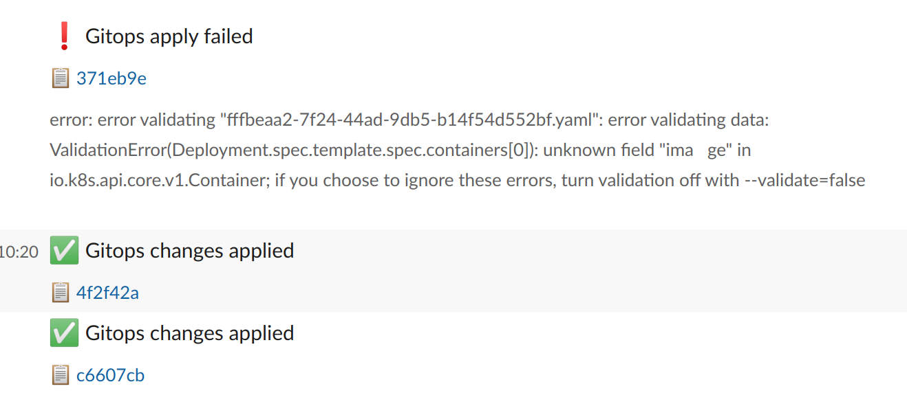

# gimletd - the GitOps release manager

GimletD acts as a release manager and detaches the release workflow from CI. By doing so, it unlocks the possibility of advanced release logics and flexibility to refactor workflows.

By assuming all release related work, it adds central control to the release workflow by introducing policy based deploys and advanced authorization and security standards, while it also optimizes the GitOps repository write performance.

Read the design docs [here](docs/design.md).

## Docker image

```bash
docker run -it ghcr.io/gimlet-io/gimletd:latest
```

## Running in Kubernetes

```bash
cat << EOF > values.yaml
image:
    repository: ghcr.io/gimlet-io/gimletd
    tag: latest
    
volumes:
  - name: data
    path: /var/lib/gimletd
    size: 10Gi
    storageClass: default
EOF

helm template gimletd onechart/onechart -f values.yaml
```

with ingress and TLS:

```bash
cat << EOF > values.yaml
containerPort: 8888
image:
  repository: ghcr.io/gimlet-io/gimletd
  tag: latest
probe:
  enabled: true
  path: /
volumes:
  - name: data
    path: /var/lib/gimletd
    size: 10Gi
    storageClass: default
ingress:
  annotations:
    kubernetes.io/ingress.class: nginx
    cert-manager.io/cluster-issuer: letsencrypt
  host: gimletd.my-company.com
  tlsEnabled: true
EOF

helm template gimletd onechart/onechart -f values.yaml
```

## First start

When you first start GimletD, it inits a file based SQLite3 database, and prints the admin token to the logs.

Use this token to create a regular user token:

```bash
curl -i \
    -H "Content-Type: application/json" \
    -H "Accept: application/json" \
    -X POST -d '{"login":"laszlo"}' \
    http://localhost:8888/api/user?access_token=$GIMLET_TOKEN
```

Save the returned user token from the result.

## Gitops worker config

```
GITOPS_REPO=laszlocph/gimletd-test
GITOPS_REPO_DEPLOY_KEY_PATH=deploykey # read-only deploykey for the gitops repo
```

## Notifications

### Create a Slack app

To generate a new Slack token visit the https://api.slack.com/apps page and follow these steps:

- Create a new application. "App Name" is Gimlet, pick your workspace as "Development Slack Workspace"
- Navigate to "OAuth & Permissions" on the left sidebar
- Under "Bot Token Scopes", add scopes `chat:write`, `chat:write.customize` and `chat:write.public`
- Click the "Install App to Workspace" button on the top of the page
- Once you installed the app, save "Bot User OAuth Access Token" in Gimlet above

```
NOTIFICATIONS_PROVIDER=slack
NOTIFICATIONS_TOKEN=<Bot User OAuth Access Token>
NOTIFICATIONS_DEFAULT_CHANNEL=testing
NOTIFICATIONS_CHANNEL_MAPPING=prod=alerts,staging=staging
```

### Configure Flux in the gitops repo to notify GimletD

Generate a Gimlet user for Flux:

```bash
curl -i \
    -H "Content-Type: application/json" \
    -H "Accept: application/json" \
    -X POST -d '{"login":"flux"}' \
    http://localhost:8888/api/user\?access_token\=$GIMLET_ADMIN_TOKEN
```

Create the notifications.yaml file under `<your-env>/flux/notifications.yaml`

```yaml
apiVersion: notification.toolkit.fluxcd.io/v1beta1
kind: Provider
metadata:
  name: gimletd
  namespace: flux-system
spec:
  type: generic
  address: https://gimletd.<your-company-com>/api/flux-events?access_token=<token>
---
apiVersion: notification.toolkit.fluxcd.io/v1beta1
kind: Alert
metadata:
  name: all-kustomizations
  namespace: flux-system
spec:
  providerRef:
    name: gimletd
  eventSeverity: info
  eventSources:
    - kind: Kustomization
      namespace: flux-system
      name: '*'
  suspend: false
```

Then you will see the notifications reaching Slack:



### Configure Github Status lines on Gitops write

Set `GITHUB_STATUS_TOKEN` with a Github Personal Access Token with `repo:status` permission.
